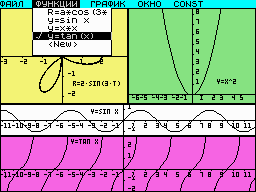

# isdos-utils

[iS-DOS] is a disk operating system for [ZX-Spectrum] home computer equipped with a [Beta Disk interface] disk drive controller, which was widespread in the countries of the former USSR.

This section presents programs by Mikhail Ulanov, written in 1995-1997 for the iS-DOS system.

Since iS-DOS was designed for Russian-speaking users, and most of the system programs have a Russian user interface, the programs presented in this section also have only a Russian interface and Russian-language documentation.

All programs are coded using Z-80 assembler.

[iS-DOS]: https://en.wikipedia.org/wiki/IS-DOS
[ZX-Spectrum]: https://en.wikipedia.org/wiki/ZX_Spectrum
[Beta Disk interface]: https://en.wikipedia.org/wiki/Beta_Disk_Interface

## iS-DOS graph

[iS-DOS graph](graph/README.md) is a program for plotting mathematical functions. Cartesian and polar coordinate systems are supported, as well as parametric function assignment.
Numerical integration of functions is possible.
Built-in calculator included.

